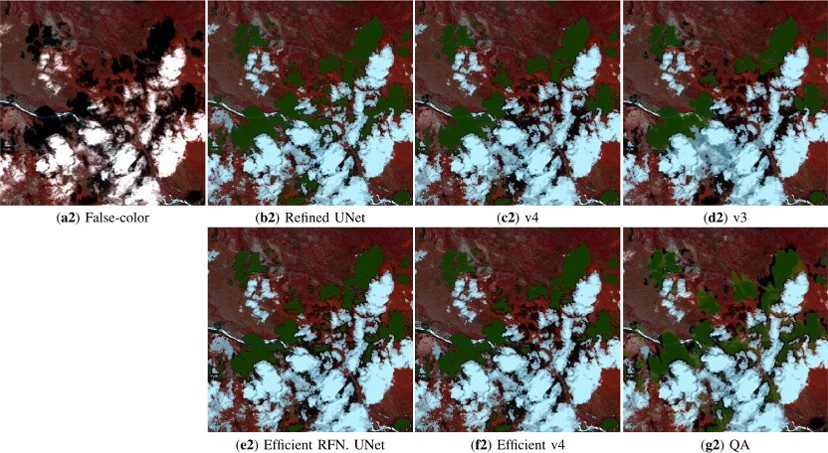
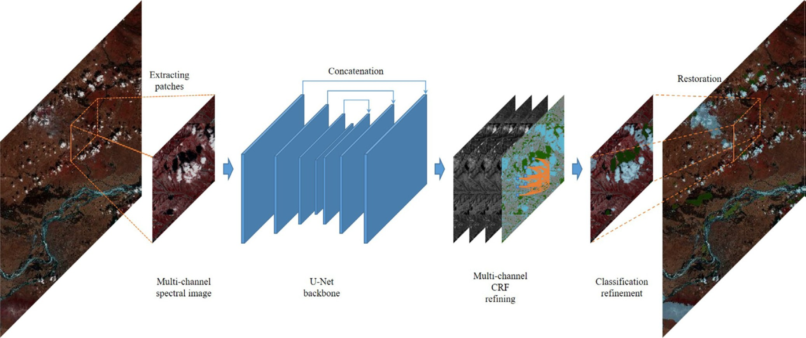
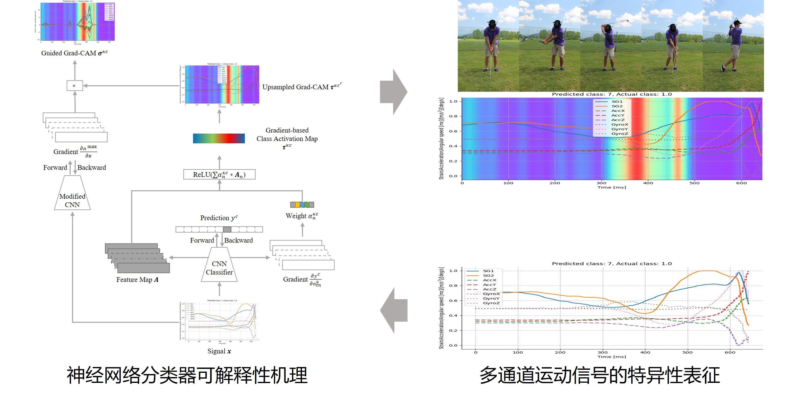
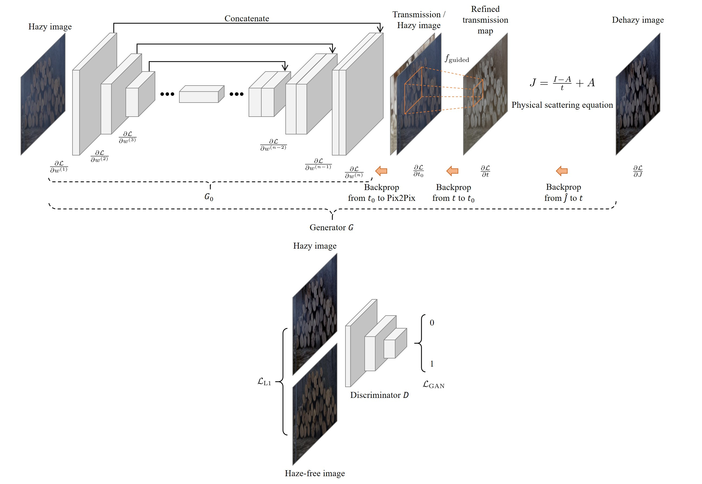

Hi there!
=========

This is Jiao Lobel. My research interests include machine learning and computer vision. 

Efficient boundary-aware segmentation for high-resolution images
----------------------------------------------------------------

- In this research, we focus on the efficiency and boundary-awareness for objects of interest in high-resolution images. 
- Multiple solutions, built on approximate algorithms, GPU deployment, and multi-thread implementations for CRF inference, have been tried and give rise to significant boundary-awareness and efficiency gain.
- This has been applied to cloud/shadow detection in high-resolution remote sensing images. 
- Source codes and experimental illustrations are publicly available at
  - Refined UNet v3: https://github.com/jiaolobel/refined-unet-v3;
  - Refined UNet v4: https://github.com/jiaolobel/refined-unet-v4;
  - Permutohedral Refined UNet: https://github.com/jiaolobel/permutohedral-refined-unet;
  - Efficient Refined UNets: https://github.com/jiaolobel/efficient-refined-unets;
  - Efficient global Perm. Refined UNet (work in progress): https://github.com/jiaolobel/perm-refined-unet-efficient-impls.
- This research was financed in part by China Postdoctoral Science Foundation, in part by Special Research Assistant Foundation of CAS, and in part by AIRCAS, and is currently financed by National Natural Science Foundation of China.
- It would be much appreciated if you could cite our articles, provided that our research is of any help.
  1. Jiao L, Huo L, Hu C, Tang P. Refined UNet: UNet-Based Refinement Network for Cloud and Shadow Precise Segmentation[J]. Remote Sensing, 2020, 12(12): 2001.
  1. Jiao L, Huo L, Hu C, Tang P. Refined UNet v3: Efficient end-to-end patch-wise network for cloud and shadow segmentation with multi-channel spectral features[J]. Neural Networks, 2021, 143: 767-782.
  1. Jiao L, Huo L, Hu C, Tang P, Zhang Z. Permutohedral Refined UNet: Bilateral Feature-Scalable Segmentation Network for Edge-Precise Cloud and Shadow Detection[J]. IEEE Journal of Selected Topics in Applied Earth Observations and Remote Sensing, 2024, 17: 10468-10489.
  2. Jiao L, Huo L, Hu C, Tang P, Zhang Z. Efficient Refined UNets: Efficient segmentation networks for boundary-aware cloud and shadow detection[J]. Expert Systems with Applications, 2026, 297: 129403.

Movement classification and visual interpretation for golf swings
-----------------------------------------------------------------

- In this research, we try to illustrate the relations between movement classes and input 1D signals.
- This is applied to the visual interpretation of golf swings.
- Source codes are publicly available at https://github.com/jiaolobel/golf-guided-gradcam.
- This research was financed in part by Foreign Expert Project of Ministry of Science and Technology of China and in part by 2022 China-CEEC Higher Education Institutions Joint Educational Program.
- It would be much appreciated if you could cite our articles, provided that our research is of any help.
  1. Jiao L, Gao W, Bie R, et al. Golf Guided Grad-CAM: attention visualization within golf swings via guided gradient-based class activation mapping[J]. Multimedia Tools and Applications, 2024, 83: 38481–38503.

Image enhancement for remote sensing images
-------------------------------------------

- In this research, we try to enhance the visibility and clarity in a boundary-aware style by removing haze from images.
- Source codes are publicly available at
  - Guided-Pix2Pix: https://github.com/jiaolobel/guided-pix2pix;
  - Guided-Pix2Pix+: https://github.com/jiaolobel/guided-pix2pixplus.
- This research was financed in part by China Postdoctoral Science Foundation and in part by Special Research Assistant Foundation of CAS.
- It would be much appreciated if you could cite our articles, provided that our research is of any help.
  1. Jiao L, Hu C, Huo L, Tang P. Guided-Pix2Pix: End-to-End Inference and Refinement Network for Image Dehazing[J]. IEEE Journal of Selected Topics in Applied Earth Observations and Remote Sensing, 2021, 14: 3052-3069.
  2. Jiao L, Hu C, Huo L, Tang P. Guided-Pix2Pix+: End-to-end spatial and color refinement network for image dehazing[J]. Signal Processing: Image Communication, 2022, 107: 116758.
